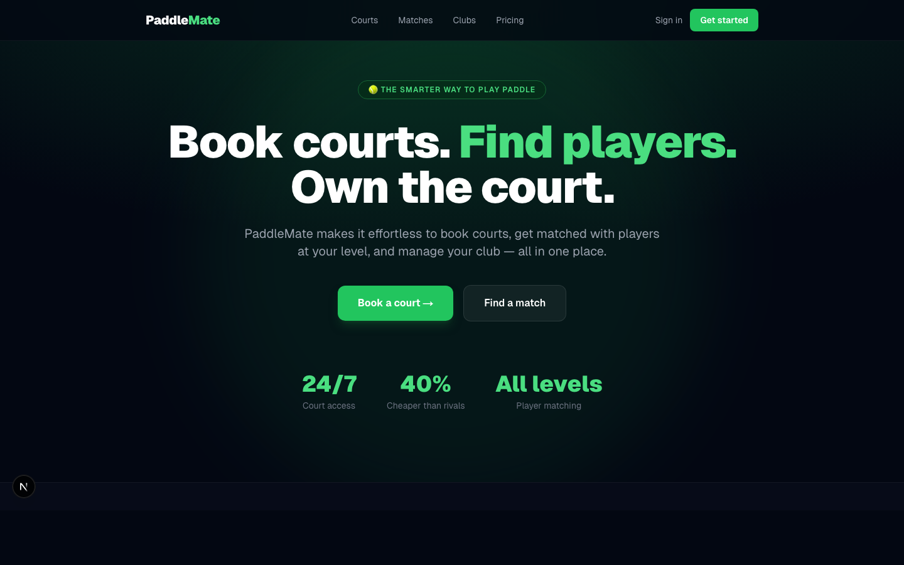
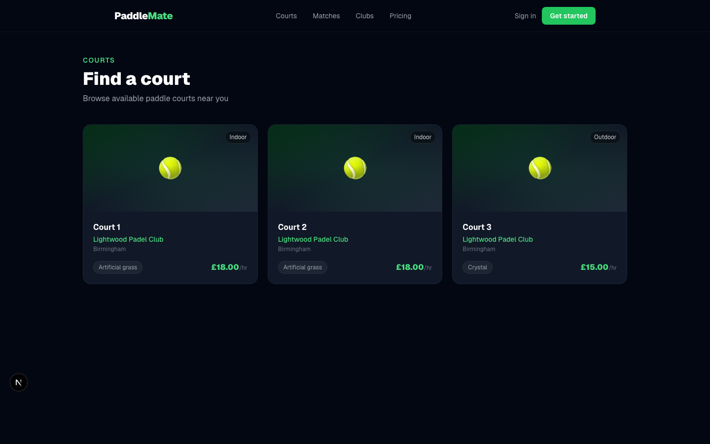
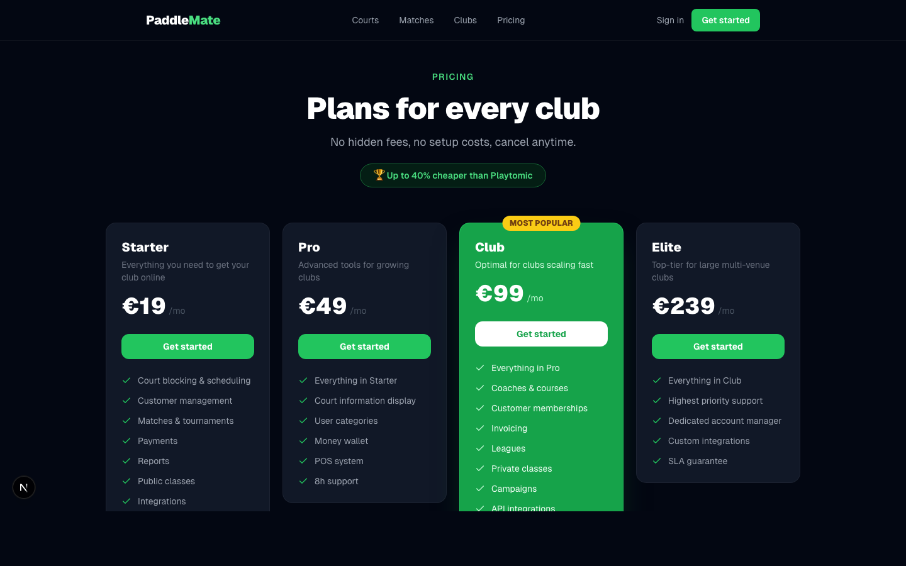

# PaddleMate

> The smarter, cheaper alternative to Playtomic. Book courts, find players, manage clubs — all in one place.



---

## Overview

PaddleMate is a full-stack paddle sports platform built for clubs and players. It lets venues publish courts online, accept bookings 24/7, and match players by skill level — at up to **40% less** than existing platforms.

Built as a pitch-ready demo for onboarding real venues.

---

## Screenshots

### Web App

| Home | Courts | Pricing |
|------|--------|---------|
|  |  |  |

### Mobile App (iOS & Android)

Dark-themed native app with court booking, match finding, club browsing, and booking management — available via Expo Go.

---

## Features

| Feature | Web | Mobile |
|---------|-----|--------|
| Browse & search courts | ✅ | ✅ |
| Real-time slot availability | ✅ | ✅ |
| Court booking with payment | ✅ | ✅ |
| Cancel bookings | ✅ | ✅ |
| Player match board | ✅ | ✅ |
| Club directory | ✅ | ✅ |
| Club admin dashboard | ✅ | — |
| Auth (email/password) | ✅ | ✅ |
| User profile & skill level | ✅ | ✅ |

---

## Pricing

Up to 40% cheaper than Playtomic:

| Plan | Price | Best for |
|------|-------|----------|
| Starter | €19/mo | Single-court clubs getting online |
| Pro | €49/mo | Growing clubs with advanced tools |
| Club | €99/mo | Scaling venues (most popular) |
| Elite | €239/mo | Large multi-venue clubs |

---

## Tech Stack

| Layer | Technology |
|-------|-----------|
| Monorepo | Turborepo + npm workspaces |
| Web | Next.js 15 (App Router, RSC) |
| Mobile | Expo SDK 54 + Expo Router v6 |
| Backend | Supabase (PostgreSQL + Auth + RLS + Realtime) |
| Styling (web) | Tailwind CSS v4 |
| Styling (mobile) | React Native StyleSheet |
| Icons (mobile) | lucide-react-native |
| Language | TypeScript throughout |

---

## Project Structure

```
paddlemate/
├── apps/
│   ├── web/                  # Next.js 15 web app
│   │   ├── src/app/          # App Router pages
│   │   ├── src/components/   # UI components
│   │   └── src/lib/          # Supabase client (server + browser)
│   └── mobile/               # Expo React Native app
│       ├── app/              # Expo Router screens
│       │   ├── (auth)/       # Login & signup
│       │   ├── (tabs)/       # Main tab screens
│       │   ├── court/[id]    # Court detail + booking
│       │   └── club/[id]     # Club detail
│       ├── constants/        # Color palette
│       └── lib/              # Supabase client
├── packages/
│   ├── shared/               # Shared TypeScript types
│   └── supabase/             # DB types & query helpers
├── supabase/
│   └── migrations/           # Full DB schema with RLS
└── screenshots/              # App screenshots
```

---

## Database Schema

Core tables (all with Row Level Security):

- `profiles` — extends `auth.users` with full_name, skill_level, bio
- `clubs` — venue details, contact info, active status
- `club_members` — role-based membership (admin / member)
- `courts` — per-club courts with surface, type, price
- `bookings` — court reservations with status lifecycle
- `matches` — open match board linked to bookings
- `match_players` — players joined to a match

---

## Getting Started

### Prerequisites

- Node.js >= 20
- npm >= 10
- Supabase account (or local Supabase CLI)
- Expo Go app (for mobile development)

### Setup

```bash
# Clone and install
git clone https://github.com/islas104/PaddleMate.git
cd PaddleMate
npm install --legacy-peer-deps

# Set environment variables
cp apps/web/.env.example apps/web/.env.local
cp apps/mobile/.env.example apps/mobile/.env.local
# → Fill in your NEXT_PUBLIC_SUPABASE_URL and NEXT_PUBLIC_SUPABASE_ANON_KEY

# Run the DB migration in Supabase SQL editor
# → Copy contents of supabase/migrations/20240101000000_init.sql and run it

# Start web app
cd apps/web
npm run dev
# → http://localhost:3000

# Start mobile app (separate terminal)
cd apps/mobile
npx expo start
# → Scan QR with Expo Go on your phone
```

---

## Environment Variables

### Web (`apps/web/.env.local`)

```
NEXT_PUBLIC_SUPABASE_URL=your_supabase_url
NEXT_PUBLIC_SUPABASE_ANON_KEY=your_supabase_anon_key
```

### Mobile (`apps/mobile/.env.local`)

```
EXPO_PUBLIC_SUPABASE_URL=your_supabase_url
EXPO_PUBLIC_SUPABASE_ANON_KEY=your_supabase_anon_key
```

---

## Mobile App Screens

| Screen | Description |
|--------|-------------|
| Courts | Browse all active courts with price and surface type |
| Court detail | Time slot picker with real-time availability, booking confirmation |
| Matches | Open match board — join games by skill level |
| Clubs | All partnered venues with contact info |
| Club detail | Club info, courts list, tap-to-call/email |
| Bookings | Upcoming and past bookings with cancel flow |
| Profile | Stats, skill level badge, sign out |
| Login / Signup | Dark-themed auth screens |

---

## License

Private — all rights reserved. Built by islas104.
